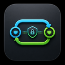

# AutoRPF



AutoRPF is a small macOS menu bar app for starting and stopping a reverse SSH port forwarding tunnel.

```bash
ssh -N -R 127.0.0.1:<remote-port>:127.0.0.1:<local-port> <target>
```

It is useful when you often need the same remote port forward and want a simple menu bar switch instead of typing the SSH command each time.

## Requirements

- macOS 13 or newer.

## What It Does

- Starts or stops one active reverse SSH tunnel.
- Reads SSH targets from `~/.ssh/config`.
- Supports a custom SSH target.
- Lets you edit local and remote ports, with optional port sync.
- Can launch at login.
- Can show the running target name next to the menu bar icon.

## Build From Source

```bash
make build-release
```

After launch, AutoRPF appears in the macOS menu bar.
